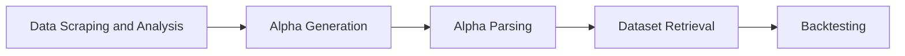

# 🧠 Brainiac: Agentic AI-driven Quantitative Alpha Builder

Welcome to **Brainiac**! Created in 2024, this project aims to streamline the generation, refinement, and evaluation of financial alphas.

Brainiac leverages _agentic AI technologies_ to autonomously navigate through vast amounts of financial research, crafting and optimizing financial alphas. The goal is to equip quantitative analysts and traders with a powerful tool to streamline alpha generation.

## 🌟 Key Features

- **Agentic AI System**: Utilizes a cutting-edge AI framework for autonomous scraping and analysis of financial research papers, extracting actionable insights to craft financial alphas.
- **LangChain Integration**: Employs LangChain to foster an agentic reinforcement learning framework, enhancing the alpha generation process through continuous learning and adaptation.
- **Alpha Parsing and Dataset Retrieval**: Converts generated alphas into WorldQuant Fast Expression language, leveraging RAG (Retrieval-Augmented Generation) to find the right dataset tailored to each alpha.
- **Automated Backtesting**: Seamlessly integrates with WorldQuant's BRAIN platform, enabling automated backtesting and in-depth performance evaluation of the generated alphas.

## 🔧 Under the Hood



1. **Data Scraping and Analysis**: Scrapes financial research papers from diverse sources, employing natural language processing techniques to sift through the content and unearth potential alphas.
2. **Alpha Generation**: Uses the LangChain framework to apply reinforcement learning for refining and optimizing the initial alphas, ensuring their viability and profitability.
3. **Alpha Parsing**: Transforms the refined alphas into WorldQuant's Fast Expression language, preparing them for dataset retrieval and backtesting.
4. **Dataset Retrieval**: Engages RAG to fetch the most relevant datasets for each alpha, ensuring that backtesting is conducted with the most suitable and comprehensive data.
5. **Backtesting**: Conducts backtesting of the alphas, now paired with their datasets, on the WorldQuant BRAIN platform, yielding detailed performance evaluations.

## 🚀 Getting Started

Before getting started, please ensure you have the following:

- Access to financial research papers and datasets.
- An account with the WorldQuant BRAIN platform for backtesting.
- A foundational understanding of financial alphas and quantitative trading strategies.

### 📥 Installation

Follow these steps to set up the project:

```bash
# Clone the repository
git clone https://github.com/jdhruv1503/Brainiac.git

# Navigate to the project directory
cd brainiac

# Install dependencies
pip install -r requirements.txt
```

After this, add your WorldQuant BRAIN credentials as in the format in `example.json` in the `Simulation/creds` folder, in multiple `json` files.

### 🔑 API Keys

Brainiac requires API keys from LlamaParse and DeepInfra to function properly. Follow these steps to set up the necessary API keys:

- Obtain API keys from LlamaParse and DeepInfra.
- Set the `LLAMA_PARSE_API_KEYS` environment variable to a comma-separated list of your LlamaParse API keys.
- Set the `DEEPINFRA_API_KEYS` environment variable to a comma-separated list of your DeepInfra API keys.
  
For example:

```bash
export LLAMA_PARSE_API_KEYS="your_llamaparse_key1,your_llamaparse_key2"
export DEEPINFRA_API_KEYS="your_deepinfra_key1,your_deepinfra_key2
```

### 🎯 Usage

```
# Run the simulation API
cd Simulation
python3 main.py
```

Now that this is running in the background, dump all your research PDFs into the `AlphaGenerator/ResearchPDFs` folder. Dump all text strategies into the `AlphaGenerator/Strategies` folder. Then, run `python3 watchdog.py`. This will look for changes in these 2 folders, when a new source is detected, will create alphas and send them to be backtested to the running simulation API.

### 📊 Results

Your alphas should be stored in a systematic way as a SQLite database `Simulation/alphas/alpha_results.db`

## 🔮 Future Enhancements

- [] Continous learning and alpha improvement agent framework to be added
- [] Automated scraping of strategies and SSRN papers
- [] Integration of USA datasets

## 🙏 Acknowledgements

Special thanks to the incredible [RussellDash332/WQ-Brain](https://github.com/RussellDash332/WQ-Brain) repo, which served as the foundation for the API automation for BRAIN!


---
_Start building powerful alphas with Brainiac today and revolutionize your quantitative trading strategies! 🚀_